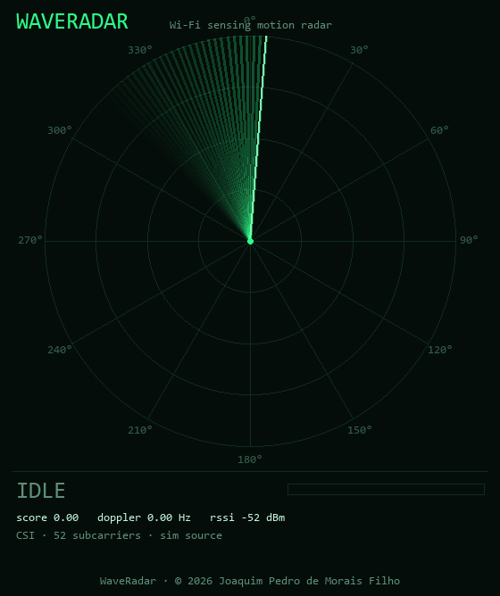

<div align="center">

# 📡 WaveRadar

### Wi-Fi Sensing Motion Radar

**See movement through the radio channel of your own router — CSI, Doppler and amplitude/phase analysis, rendered as a live radar display.**

[](LICENSE)
[](https://python.org)
[](#quick-start)
[](https://elevbit-ai.github.io/waveradar/)

[**Website**](https://elevbit-ai.github.io/waveradar/) · [**Demo video**](https://elevbit-ai.github.io/waveradar/#demo) · [**Português (BR)**](README.pt-BR.md)



</div>

---

## What is this?

Every Wi-Fi packet that crosses a room is deformed by everything the radio
waves bounce off — walls, furniture, **and moving bodies**. A person walking
between your router and your laptop perturbs the multipath channel and leaves
a measurable fingerprint: amplitude fluctuations, phase rotation, and a
**Doppler signature** in the 0.15–4 Hz band that matches human motion.

WaveRadar captures that fingerprint and turns it into a live, radar-style
display in your browser — sweep, blips, Doppler spectrum and waterfall — with
**no cameras and no extra sensors**.

## Quick start

**Windows** (PowerShell):

```powershell
irm https://elevbit-ai.github.io/waveradar/install.ps1 | iex
```

**Linux / macOS**:

```bash
curl -fsSL https://elevbit-ai.github.io/waveradar/install.sh | bash
```

**Or with pip / from source**:

```bash
pip install "waveradar[esp32] @ git+https://github.com/elevbit-ai/waveradar.git"
waveradar                      # radar from your router's signal
waveradar --source sim         # no-hardware demo (synthetic target)
```

The radar opens at `http://127.0.0.1:8347`. It calibrates for a few seconds
(learning the quiet channel), then walk around — you'll see it.

## Sensing modes

| Mode | Hardware | Signal | What you get |
|---|---|---|---|
| **RSSI** (default) | None — any router + your PC's Wi-Fi | Received signal strength, ~6–9 Hz | Motion presence, intensity, dominant Doppler frequency |
| **CSI / ESP32** | One $4 ESP32 dev board | ~52 subcarriers, amplitude + phase, 50–100 Hz | Everything above, plus per-subcarrier structure → richer micro-Doppler and multi-sector radar blips |
| **Simulator** | None | Synthetic 52-subcarrier CSI | Full pipeline demo, used for the video above |

For CSI mode, flash the included firmware:
**[`firmware/esp32/`](firmware/esp32/)** (Arduino IDE, 5 minutes). The parser
also accepts Espressif's official [`esp-csi`](https://github.com/espressif/esp-csi)
output format.

## How it works

```
router ))) radio waves ))) moving body ))) perturbed multipath ))) receiver
                                                                      │
   ┌──────────────────────────────────────────────────────────────────┘
   ▼
 sliding window (64 samples)
   → detrend (remove static paths / drift)
   → Hann window + FFT per channel
   → band-limit to 0.15–4 Hz  ..............  human-motion Doppler band
   → band energy vs adaptive quiet baseline   →  motion score (0–1)
   → argmax of the aggregate spectrum         →  dominant Doppler (Hz)
   → per-subcarrier energy, grouped in 12 sectors  →  radar blips
   ▼
 local web server (stdlib) → canvas radar UI, polled at ~12 Hz
```

- **Amplitude/phase variation** — a moving reflector changes the length of
  the paths the signal travels, modulating subcarrier amplitude and phase.
- **Doppler** — motion at speed *v* shifts reflected energy by roughly
  `f_d = 2v/λ` (≈ 16 Hz per m/s at 2.4 GHz); body-scale sway, gestures and
  walking concentrate in **0.15–4 Hz** of channel variation, which is exactly
  the band WaveRadar isolates.
- **CSI (Channel State Information)** — the per-subcarrier complex channel
  estimate every OFDM receiver already computes. The ESP32 exposes it; most
  consumer routers/adapters do not, which is why RSSI mode exists as the
  zero-hardware path.

## Honest limitations (read this)

- **The radar bearing is a pseudo-projection, not true angle-of-arrival.**
  With a single link you can detect *that* something moves, *how much*, and
  its Doppler content — not its absolute position. In CSI mode, blip bearing
  reflects which subcarrier groups (i.e. which multipath components) are
  being perturbed: it is stable and repeatable for a given room, but it is
  not a calibrated map. True localisation needs multiple antennas or links.
- **RSSI mode is coarser than CSI mode** — one channel instead of ~52. It
  reliably detects presence/motion near the link; small gestures far from
  the line-of-sight may not register.
- Range rings encode dominant Doppler (interaction strength), not metres.
- Very windy rooms (fans, curtains), pets and neighbouring interference all
  move the baseline; the adaptive calibration absorbs slow changes but
  physics is physics.

## Privacy & responsible use

WaveRadar senses motion in the environment of **your own network and your
own devices**. Use it in spaces you own or administer, with the knowledge of
the people in them (e.g. home security, elder-care presence, maker
experiments). Wi-Fi sensing of spaces you have no right to monitor may be
illegal where you live — don't.

## Project layout

```
waveradar/            Python package
  dsp.py              sliding-window FFT, Doppler, motion score, sectors
  server.py           stdlib web server + JSON state API
  web/index.html      canvas radar UI (sweep, blips, spectrum, waterfall)
  sources/            windows_rssi · linux_rssi · esp32_csi · simulator
firmware/esp32/       CSI streamer sketch (Arduino IDE)
scripts/make_demo.py  renders the demo video through the real DSP pipeline
docs/                 website (GitHub Pages) + demo assets
```

## Author

**Joaquim Pedro de Morais Filho**
📧 [j360074@hotmail.com](mailto:j360074@hotmail.com)

Licensed under the [MIT License](LICENSE) — © 2026 Joaquim Pedro de Morais Filho.
